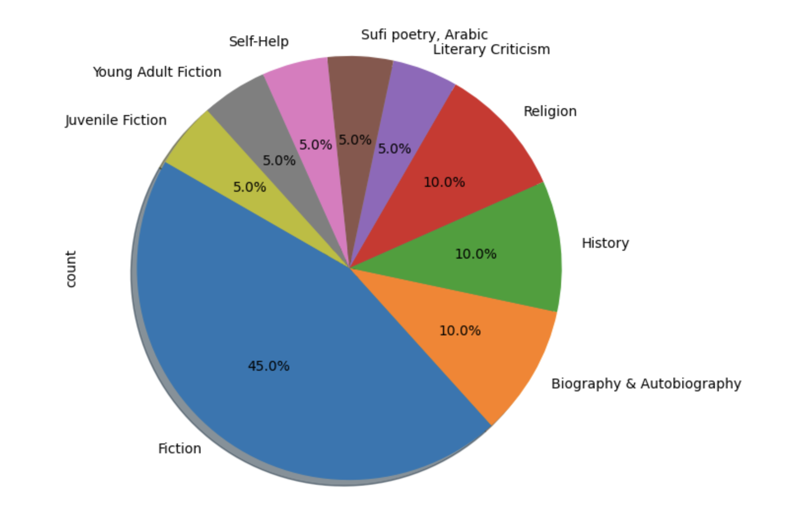
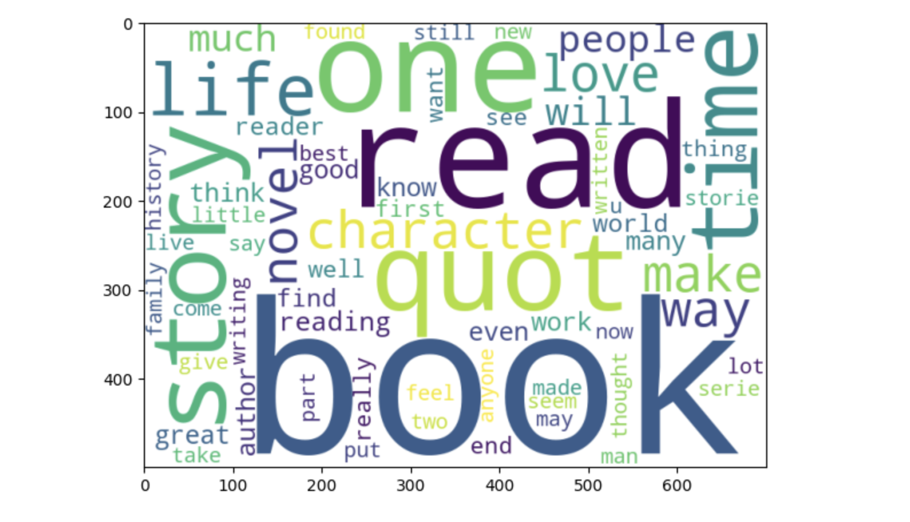
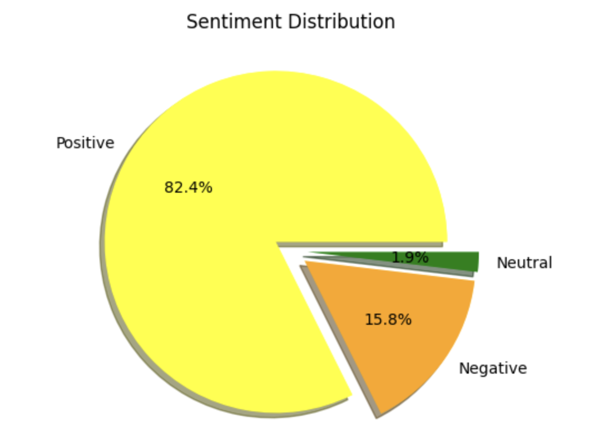
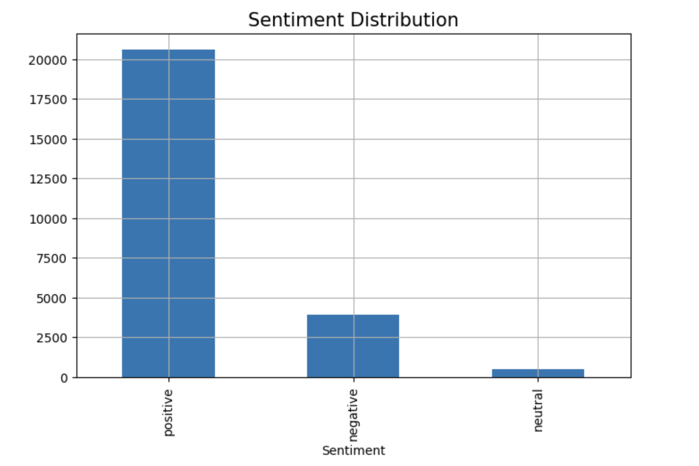

# Sentiment Analysis 

## Overview
This project performs sentiment analysis on a dataset of textual reviews using the VADER (Valence Aware Dictionary and sEntiment Reasoner) sentiment analysis tool. It also visualizes the results through:
- Pie chart representing the types of books genres for the analysis.
- A Word Cloud representing the most frequent terms.
- A Pie Chart showing the distribution of positive, negative, and neutral sentiments.

## Features
1. **Sentiment Analysis**: Analyze the sentiment of text reviews as positive, negative, or neutral using the VADER library.
2. **Word Cloud Generation**: Create a word cloud to visualize the most common words in the reviews.
3. **Sentiment Distribution Visualization**: Generate a pie chart to represent the proportion of positive, negative, and neutral reviews.
4. **Distribution of Books based on Genre**: Pie chart representing the types of books genres for the analysis.

## Requirements
### Prerequisites
Ensure the following are installed:
- Python (>= 3.7)
- Libraries:
  - `pandas` for data manipulation
  - `matplotlib` for plotting
  - `seaborn` for enhanced plots (optional)
  - `wordcloud` for word cloud generation
  - `nltk` for text processing
  - `vaderSentiment` for sentiment analysis

### Installation
To install the required libraries, run:
```bash
pip install pandas matplotlib seaborn wordcloud nltk vaderSentiment
```

## Dataset
Provide a dataset of textual reviews in a CSV file with at least one column containing the text (e.g., `reviews.csv`). Update the file path in the script accordingly.

## Usage
### 1. Analyze Sentiment
The script uses the VADER SentimentIntensityAnalyzer to classify reviews into:
- Positive (compound score > 0.05)
- Neutral (-0.05 <= compound score <= 0.05)
- Negative (compound score < -0.05)

### 2. Generate Visualizations
- **Word Cloud**: Highlights frequently used words in the dataset.
- **Pie Chart**: Visualizes the sentiment distribution.

### 3. Run the Script
Update the script with the path to your dataset and execute it.
```bash
python sentiment_analysis.py
```

## Example Output
### Word Cloud
Displays a visualization of the most common words in the reviews, excluding stopwords.

### Sentiment Distribution
A pie chart representing the proportions of positive, neutral, and negative reviews.

## Code Structure
### Step 1: Import Libraries
```python
import pandas as pd
import matplotlib.pyplot as plt
from wordcloud import WordCloud
from vaderSentiment.vaderSentiment import SentimentIntensityAnalyzer
```

### Step 2: Load and Preprocess Data
```python
data = pd.read_csv('reviews.csv')
data['review_text'] = data['review_text'].astype(str)
```

### Step 3: Perform Sentiment Analysis
```python
analyzer = SentimentIntensityAnalyzer()

# Add sentiment scores to DataFrame
data['compound'] = data['review_text'].apply(lambda x: analyzer.polarity_scores(x)['compound'])
data['sentiment'] = data['compound'].apply(lambda x: 'positive' if x > 0.05 else ('neutral' if x >= -0.05 else 'negative'))
```

### Step 4: Visualizations
#### Word Cloud
```python
text = ' '.join(data['review_text'])
wordcloud = WordCloud(background_color='white', width=800, height=400).generate(text)
plt.figure(figsize=(10, 5))
plt.imshow(wordcloud, interpolation='bilinear')
plt.axis('off')
plt.title('Word Cloud of Reviews')
plt.show()
```

#### Sentiment Distribution
```python
plt.figure(figsize=(12, 5))
plt.subplot(1, 2, 1)
labels = ['Positive', 'Negative', 'Neutral']
sizes = data['Sentiment'].value_counts()
colors = ['yellow', 'orange', 'green']


plt.pie(sizes, explode=explode, labels=labels, colors=colors, autopct='%1.1f%%', shadow=True)
plt.title('Sentiment Distribution')
```

---
## Results

**Various Genres of books:**


**Word Cloud :**


**Sentiment Distribution Analysis in Pie Chart Visualization:**


**Sentiment Distribution Analysis in Bar Chart Visualization:**



